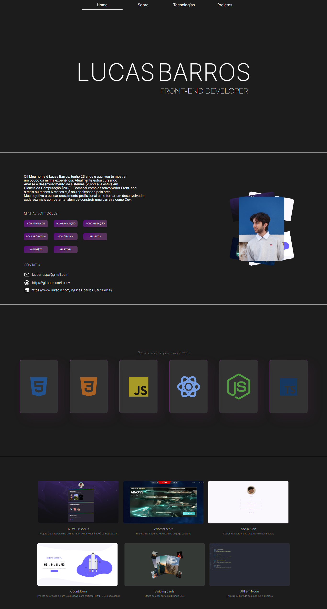

# Portifólio Lucas Barros

> Portifólio para apresentar meus trabalhos, soft e hard skills

## Tecnologias

- HTML
- CSS
- JavaScript
- jQuery
- Git e Github

# 

## Home

> Página inicial com menu fixo para navegação

- Animação de digitação em "Front-end Developer" feita em Javascript
- Menu com indicador de abas para navegação feito com Javascript e jQuery events

# 

## Sobre

> Página com uma introdução sobre mim, contato e soft skills

- Animação nos cards (lado direito) feita com CSS [^note]
- Soft skills e contato com efeitos básicos on hover e scale

[^note]: Efeito aplicado nos cards, descrito [aqui](https://github.com/Luscv/Swipe_cards)

# 

## Tecnologias

> Página com as tecnologias que tenho experiência

- Animação dos cards  feita com a biblioteca Tilt.js 
- Breve descrição em tópicos dos conteúdos que domino em cada tecnologia

# 

## Projetos

> Página com os projetos já desenvolvidos

- Título e descrição básica de cada projeto

# 

# [Clique aqui para acessar meu Portifólio!](https://luscv.github.io/Portifolio_Lucas_Barros/)

## Gostou do meu trabalho? Entre em contato!

lucbarrospc@gmail.com

[LinkedIn](https://www.linkedin.com/in/lucas-barros-8a690a150/)